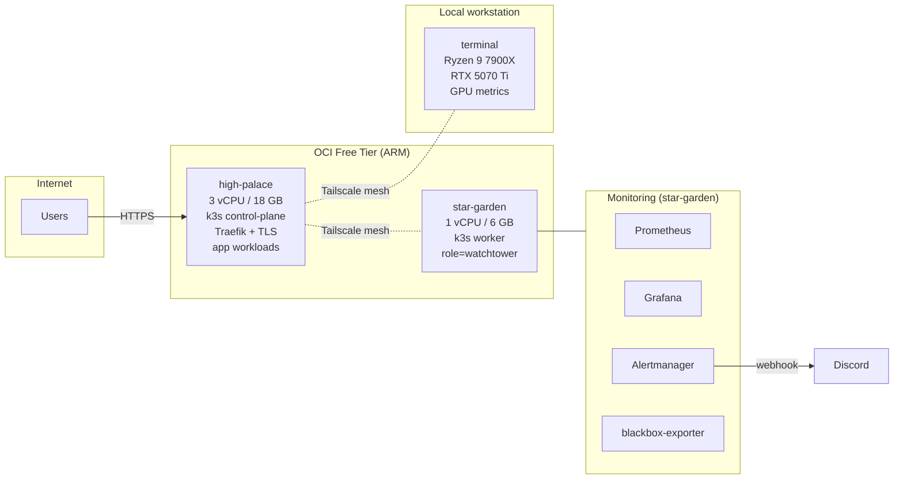

# homelab

Multi-node k3s homelab on Oracle Cloud Free Tier (ARM) with a Windows GPU node joined over Tailscale. Demonstrates IaC, observability, SLOs with burn-rate alerting, incident response with real postmortems, and the discipline of documenting what actually runs — including the failures.

## Architecture



- **Ingress**: Traefik on `high-palace`, auto-TLS via Let's Encrypt, prometheus metrics exposed for per-service latency SLIs.
- **Mesh**: Tailscale WireGuard across all three nodes. No public SSH.
- **Networking constraint, by decision**: direct pod-to-pod TCP is broken cluster-wide (kube-router + flannel interaction). Everything is deliberately designed around hostNetwork + same-node NodePorts + ClusterIP — see [ADR-001](docs/decisions/001-design-around-broken-pod-network.md) and the [postmortem](docs/postmortems/2026-05-30-kube-prom-stack-cutover-rollback.md) that surfaced it.
- **GitOps posture**: Flux helm-controller reconciles Helm charts from committed HelmReleases (chaos-mesh today); plain manifests are applied with `kubectl apply` on purpose — [ADR-002](docs/decisions/002-helm-controller-without-repo-sync.md) explains why a full sync loop was evaluated and declined at single-operator scale.

## Tech stack

| Layer | Tool |
|---|---|
| Cloud / IaC | Oracle Cloud Infrastructure, Terraform |
| OS | Oracle Linux 9 (aarch64), Windows 11 |
| Orchestration | k3s v1.34 |
| Mesh / overlay | Tailscale; flannel (see ADR-001) |
| Ingress / TLS | Traefik v3, Let's Encrypt (ACME HTTP-01) |
| Metrics | Prometheus, node-exporter, windows_exporter, nvidia_gpu_exporter, kube-state-metrics, blackbox-exporter, Traefik metrics |
| Alerting | Alertmanager → Discord (a ServiceNow incident pipeline was built, verified, and retired — [ADR-003](docs/decisions/003-retire-servicenow-pipeline.md)) |
| Chaos engineering | Chaos Mesh (Flux HelmRelease) — [chaos/](chaos/) |
| Logs | Loki + Promtail — running, manifests not yet versioned here (tracked gap) |
| Secrets | Sealed Secrets (bitnami-labs) + documented out-of-band bootstrap secrets |
| CI | GitHub Actions — kubeconform (CRD-aware) over every manifest tree, Terraform fmt/validate, dashboard JSON checks |

## Hosted workloads

- **[chronicle](https://github.com/grntsmth/chronicle)** — FastAPI + Discord calendar assistant (`ecosystem` namespace).
- Private self-hosted services (game server, custom plugins) that live outside this repo.
- Retired: **sn-translator**, an Alertmanager → ServiceNow bridge developed here (FastAPI, fingerprint-deduplicated incident lifecycle, tested batch semantics) — verified end-to-end, then retired cleanly when its dev instance expired ([ADR-003](docs/decisions/003-retire-servicenow-pipeline.md); code in git history).

## Service Level Objectives

**One real SLO is live**: ecosystem-service availability, measured by blackbox-exporter HTTP probes every 15s against Chronicle, Grafana, and Prometheus.

| Piece | Where |
|---|---|
| SLI | `probe_success` per instance, recorded as `slo:probe_availability:ratio_rate*` (5m/30m/1h/6h/30d) |
| Objective | 99% over 30 days (~7.3h error budget) |
| Fast burn alert | 14.4× budget burn over 1h AND 5m → critical (budget gone in <2 days) |
| Slow burn alert | 6× over 6h AND 30m → warning | 
| Dashboard | `monitoring/dashboards/ecosystem-slo.json` — availability, error budget remaining, burn rates |

All in [`monitoring/monitoring.yml`](monitoring/monitoring.yml) (`slo-ecosystem-availability` rule group). Next SLI candidates now that the data exists: Traefik per-service p95 latency (scraped, dashboarded, not yet an objective) and host-level indicators (alerting on absolute thresholds today).

## Reliability practices

| Practice | Implementation |
|---|---|
| Metrics + alerting | Prometheus v3.11 + Alertmanager v0.31, pinned to the watchtower node; per-node CPU thresholds, `TargetDown` coverage for every job, TLS-expiry alert |
| **Alerting-path self-monitoring** | `NotificationDeliveryBroken` + a dedicated dashboard row watch `prometheus_notifications_*` — added after delivery silently failed for six weeks ([postmortem addendum](docs/postmortems/2026-05-30-kube-prom-stack-cutover-rollback.md)) |
| Service lifecycle discipline | Built, verified, and cleanly retired a ServiceNow incident pipeline when its backing instance expired ([ADR-003](docs/decisions/003-retire-servicenow-pipeline.md)) — the tree shows what runs, history shows what ran |
| Chaos engineering | Chaos Mesh installed and healthy; committed experiments (pod-kill, cpu-stress, network-delay) run manually and on purpose — [chaos/README.md](chaos/README.md) |
| Dashboards as code | Grafana **provisions** dashboards from `monitoring/dashboards/` via ConfigMap — the repo copy is the live copy; UI-only edits get reconciled away |
| Postmortems | [Real ones only](docs/postmortems/) — current entry: a planned migration that failed on a hidden constraint and rolled back cleanly |
| Runbooks | [docs/runbooks/](docs/runbooks/) — written from real incidents, including a pod-network canary check with captured baseline output |
| Decision records | [docs/decisions/](docs/decisions/) — the CNI constraint and the GitOps posture, each with revisit triggers |
| Private/public split | Workload-specific scrape jobs, alert rules, and domain-facing probes arrive via **private overlay ConfigMaps** (`scrape_config_files` + `rule_files` globs) so this repo stays fully public and fully deployable with zero placeholder edits |

### Known gaps (tracked, not hidden)

- **Loki/Promtail/Uptime Kuma run unversioned** — deployed long ago, manifests never committed anywhere; Promtail's push path also needs the ADR-001 treatment. Fix or decommission is next on the list.
- **No platform-layer backups.** Workload backups (6h world CronJob, nightly pg_dump) are managed privately; Prometheus TSDB, Grafana PVC, and k3s etcd snapshots are a tracked TODO, as are offsite copies.
- **Terraform state is local-only** (see terraform/README.md for the remote-state plan).

## Security posture

**Network**
- **No public SSH.** OCI security list allows 22 only from the Tailscale CGNAT range; public ingress is 80/443 (Traefik). See `terraform/network.tf`.
- **Tailscale addresses appear in committed manifests deliberately.** They are CGNAT-range and unreachable without tailnet membership — the tailnet ACL is the boundary, not obscurity. Domains, e-mail addresses, cloud OCIDs, and instance hostnames are *not* committed; environment-specific values arrive via out-of-band ConfigMaps/Secrets documented per component.
- NetworkPolicies: workload namespaces (private repo) run zero-trust policies; the `monitoring` namespace runs permissive policies while kube-router remains the enforcer (ADR-001 — the enforcer is also the pod-network breaker, a tension the CNI decision will resolve).

**TLS** — auto-issued via Let's Encrypt HTTP-01 (`platform/traefik-config.yml`), ACME state on a persistent volume, `traefik_tls_certs_not_after` alerting at 14 days.

**Secrets** — never committed in plaintext: Sealed Secrets where committed at all (Grafana admin, in the private repo), documented `kubectl create` bootstrap steps otherwise. Terraform state/tfvars gitignored.

**CI** — every push/PR: CRD-aware kubeconform across `monitoring/ platform/ chaos/`, Terraform fmt+validate, JSON validation on dashboards.

## What's in this repo

```
homelab/
├── terraform/           # OCI infrastructure (VCN, security lists, ARM compute)
├── platform/            # Traefik HelmChartConfig (TLS, metrics) + example IngressRoutes
├── monitoring/          # The live stack: Prometheus, Grafana, Alertmanager,
│   │                    #   node-exporter, blackbox-exporter, SLO + alert rules
│   └── dashboards/      # Provisioned Grafana dashboards (three-realms,
│                        #   platform-health, ecosystem-slo)
├── chaos/               # Chaos Mesh HelmRelease + experiment manifests
├── docs/
│   ├── decisions/       # ADRs: the CNI constraint, GitOps posture
│   ├── postmortems/     # Blameless writeups of real incidents
│   └── runbooks/        # Known failure modes, with tested commands
└── .github/workflows/   # validate.yml — CI described above
```

## Why this exists

This is my infrastructure proof-of-work. I'm transitioning into the field from adjacent roles (systems buildout, regulated operations), and a homelab forces the discipline I'd be hired for: define SLOs, monitor what matters, respond when things break, and write down what you learn — the postmortem and ADRs in this repo document a real migration failure and the architecture that came out of it. Running on OCI Free Tier means I can't hide behind managed services; every architectural choice (and mistake) here is mine.

## Currently exploring

- **First real chaos session** — Chaos Mesh is healthy and the alert→Discord loop is verified; running pod-kill against the ecosystem namespace and writing up the timeline is the next milestone ([chaos/README.md](chaos/README.md)).
- **CNI remediation** — ADR-001 accepts the broken pod network for now; replacing kube-router/flannel (and re-attempting the kube-prometheus-stack migration with a connectivity precheck) is the deliberate future phase.
- **Log pipeline** — version or decommission Loki/Promtail/Uptime Kuma.
- **Terraform remote state** — OCI Object Storage backend with locking and versioning.

## Validate locally

```bash
# Terraform
cd terraform && terraform fmt -check -recursive && terraform validate

# Kubernetes manifests (CRD-aware)
kubeconform -strict -summary \
  -schema-location default \
  -schema-location 'https://raw.githubusercontent.com/datreeio/CRDs-catalog/main/{{.Group}}/{{.ResourceKind}}_{{.ResourceAPIVersion}}.json' \
  monitoring/ platform/ chaos/

```
