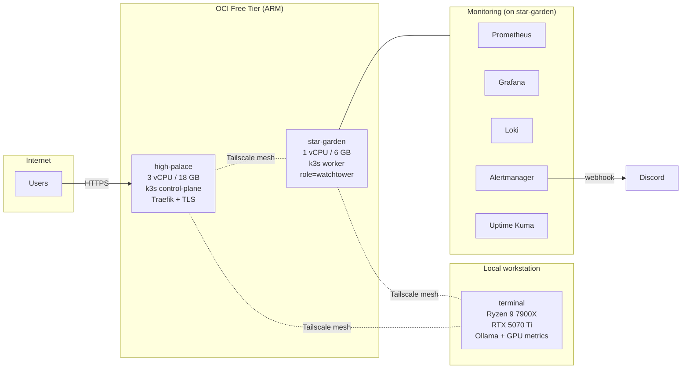

# homelab

Multi-node k3s homelab on Oracle Cloud Free Tier (ARM) with a Windows GPU node joined over Tailscale. Demonstrates IaC, observability, secure ingress, and backup discipline at small scale.

## Architecture



- **Ingress**: Traefik on `high-palace`, auto-TLS via Let's Encrypt.
- **Mesh**: Tailscale WireGuard across all three nodes. No public SSH.
- **Storage**: local-path-provisioner. Persistent volumes pinned to the node they were provisioned on.
- **GitOps**: manifests in this repo are applied with `kubectl apply -f`. Flux is on the roadmap (see below).

## Tech Stack

| Layer | Tool |
|---|---|
| Cloud / IaC | Oracle Cloud Infrastructure, Terraform |
| OS | Oracle Linux 9 (aarch64), Windows 11 |
| Orchestration | k3s v1.34 |
| Mesh / overlay | Tailscale, flannel VXLAN |
| Ingress / TLS | Traefik v2, Let's Encrypt (ACME HTTP-01) |
| Metrics | Prometheus, node-exporter, windows_exporter, nvidia_gpu_exporter, kube-state-metrics † |
| Logs | Loki + Promtail † |
| Alerting | Alertmanager → Discord |
| Uptime | Uptime Kuma † |
| Secrets | Sealed Secrets (bitnami-labs) † |
| CI | GitHub Actions (kubeconform + `terraform validate`) |

† Runs in the cluster but its manifests live in a private operations repo, not here. This repository's manifests cover Prometheus, Grafana, Alertmanager, node-exporter, Traefik, and the OCI infrastructure underneath.

## Hosted workloads

- **[chronicle](https://github.com/grntsmth/chronicle)** — FastAPI + Discord bot calendar assistant, deployed in the `ecosystem` namespace.
- Private self-hosted services (game server, custom plugins) that live outside this repo.

## Service Level Objectives

**Status: in development.** Formal SLOs, error budgets, and burn-rate alerts are not yet defined for this platform. The host-level indicators below are what's instrumented today — they're the foundation the SLO work will build on, not SLOs themselves.

### Candidate SLIs (instrumented today)

| SLI | PromQL | Defined in |
|---|---|---|
| Host CPU availability | `100 - (avg by(instance) (rate(node_cpu_seconds_total{mode="idle"}[5m])) * 100)` | `monitoring/monitoring.yml` |
| Host memory availability | `(1 - node_memory_MemAvailable_bytes / node_memory_MemTotal_bytes) * 100` | `monitoring/monitoring.yml` |
| Root filesystem availability | `(1 - node_filesystem_avail_bytes{mountpoint="/"} / node_filesystem_size_bytes{mountpoint="/"}) * 100` | `monitoring/monitoring.yml` |
| Per-node scrape liveness | `up{job=~"node-.*"}` | `monitoring/monitoring.yml` |

Each of the above already drives a threshold alert (warnings at 90% for CPU/memory, critical at 85% for disk, critical when a node-exporter scrape fails for 3m). The honest gap between these and real SLOs:

1. **No target reliability** (e.g., "99.5% of CPU samples below 80% over 30d"). Alerts fire on absolute thresholds, not on objectives.
2. **No error-budget tracking** and no burn-rate alerts (fast/slow multi-window).
3. **No per-service SLIs.** Traefik ingress latency, Chronicle uptime, and external HTTP success-rate are not scraped today.

Closing those three gaps is the next concrete piece of work — see [Currently exploring](#currently-exploring).

## Reliability Practices

| Practice | Implementation | Cite |
|---|---|---|
| Metrics + alerting stack | Prometheus v3.11.0 + Alertmanager v0.31.1, pinned to `role=watchtower` worker via nodeSelector | `monitoring/monitoring.yml` |
| Notification routing | Alertmanager → inline Python webhook sidecar → Discord; critical alerts repeat every 1h, warnings every 4h | `monitoring/monitoring.yml` (`alertmanager-config` ConfigMap + `discord-webhook` sidecar) |
| Alert on-call surface | 4 host-health rules: `HighCPUUsage`, `HighMemoryUsage`, `DiskSpaceLow`, `NodeExporterDown` | `monitoring/monitoring.yml` (`alerts.yml` in the Prometheus ConfigMap) |
| Apply mechanism | `kubectl apply -f` against the manifests in this repo — single operator, no reconciliation controller | `monitoring/README.md`, `platform/README.md` |
| CI validation | GitHub Actions: `kubeconform --strict` over `monitoring/` + `platform/`, plus `terraform fmt -check` and `terraform validate` on every push and PR to `main` | `.github/workflows/validate.yml` |
| Persistent state | `prometheus-data` PVC (20 Gi, 30d retention), `grafana-data` PVC (5 Gi), ACME storage PVC (128 Mi) | `monitoring/monitoring.yml`, `platform/traefik-config.yml` |

### Dashboards as code

- **`monitoring/dashboards/three-realms.json`** — `Fortress Infrastructure — Three Realms`, the cross-node infrastructure overview (CPU, memory, disk, GPU, K8s pods, scrape duration). Exported from the running Grafana on `star-garden` and versioned alongside the manifests that produce its data. See `monitoring/dashboards/README.md` for import notes.

Per-service SLO dashboards are not yet exported here — they'll land alongside the SLO work in *Currently exploring*.

### Known gaps

- **No platform-layer backups in this repo.** Workload-level backup (Minecraft CronJob, every 6h) is managed in a private operations repo. Prometheus TSDB, Grafana dashboards-in-PVC, and k3s etcd are not yet snapshotted on a schedule. Backup-of-the-platform is a tracked TODO.
- **No recording rules.** Alert expressions are evaluated live each scrape — acceptable at this scale, worth flagging.

## Security Posture

**Network**

- **No public SSH.** OCI security list restricts port 22 to the Tailscale CGNAT range `100.64.0.0/10`. Public ingress is limited to TCP 80 and 443 (Traefik HTTP-01 challenges + HTTPS traffic). See `terraform/network.tf`.
- **Inter-node traffic on Tailscale WireGuard.** Prometheus addresses scrape targets by Tailscale IP, not public IP — see the scrape config in `monitoring/monitoring.yml`.

**TLS**

- Auto-issued via Let's Encrypt with the HTTP-01 challenge, configured through a k3s `HelmChartConfig` override at `platform/traefik-config.yml`. ACME state is persisted to a 128 Mi PVC so renewals survive pod restarts.
- All `IngressRoute` examples in `platform/traefik-routes-example.yml` reference `certResolver: letsencrypt` and the `websecure` (443) entry point; the HTTP entry point redirects to HTTPS at the Traefik layer.

**Secrets**

- Runtime secrets (Grafana admin password, Discord webhook URL, Prometheus basic-auth users file) are never committed in plaintext. The READMEs in `monitoring/` and `platform/` document the out-of-band create-secret steps.
- **Sealed Secrets** (bitnami-labs) is the encryption mechanism the cluster uses end-to-end; the controller is deployed from a private operations repo.
- `terraform/.gitignore` excludes `terraform.tfvars`, `*.tfstate`, and `*.pem` from version control.

**Workload isolation**

- Prometheus and Grafana run as non-root with explicit UIDs (`runAsUser: 65534` for Prometheus, `472` for Grafana) and `runAsNonRoot: true`. See `monitoring/monitoring.yml`.
- Prometheus's ClusterRole is scoped narrowly — `nodes`, `nodes/metrics`, `nodes/proxy`, and the `/metrics/cadvisor` non-resource URL — not full cluster-read.
- Prometheus's `/prometheus/` ingress is gated by a Traefik `basicAuth` middleware backed by an out-of-band secret (`platform/traefik-routes-example.yml`); Grafana enforces its own login.

**CI**

- Every push to `main` and every PR runs `.github/workflows/validate.yml`: `kubeconform --strict` on the K8s manifests and `terraform fmt -check` + `terraform validate` on the IaC.

### Known gaps

- **No NetworkPolicies** in the `monitoring` namespace. Workload namespaces in the private operations repo (`minecraft`, `postgres`) have zero-trust policies; the platform namespace currently relies on `hostNetwork: true` + node placement rather than policy enforcement.
- **No Pod Security Standards admission labels** on the `monitoring` namespace yet (Prometheus and Grafana already satisfy the `restricted` profile in practice).
- **No image digest pinning.** Tags are version-pinned (`prom/prometheus:v3.11.0`, etc.) but not SHA-locked.

## What's in this repo

```
homelab/
├── terraform/              # OCI infrastructure (VCN, subnets, security lists, ARM compute)
├── platform/               # Traefik HelmChartConfig + example IngressRoutes
├── monitoring/             # Prometheus, Grafana, Alertmanager, node-exporter
│   └── dashboards/         # Versioned Grafana dashboards (three-realms.json)
├── docs/                   # Runbooks and postmortems
└── .github/workflows/      # validate.yml — kubeconform + terraform fmt/validate
```

Terraform state and `terraform.tfvars` are gitignored. The monitoring and platform manifests here are sanitized — real secrets (Grafana admin password, Discord webhook, basic-auth hashes) are supplied via Kubernetes secrets or Sealed Secrets, not committed.

## Why this exists

This is my infrastructure proof-of-work. I'm transitioning into the field from adjacent infrastructure roles (systems buildout, regulated banking operations), and a homelab forces the discipline I'd be hired for: define SLOs, monitor what matters, respond when things break, document what you learn. Running on OCI Free Tier means I can't hide behind managed services — every architectural choice is mine.

## Currently exploring

- **Lightweight GitOps controller (FluxCD candidate).** ArgoCD was trialled twice in a sibling project and retired both times — it's excellent for production-scale fleets, but the sync-op and finalizer overhead outweighed the drift-detection benefit at single-operator scale, and the homelab's frequency of dynamic live edits kept fighting the reconciler. FluxCD is being evaluated as a smaller-surface alternative that won't pin manifests against the ad-hoc changes a learning lab needs.
- **SLO dashboards.** Promote the candidate SLIs above into objectives with target reliability, error-budget tracking, and multi-window burn-rate alerts; add per-service SLIs for Traefik ingress latency (p95/p99) and Chronicle uptime.
- **Terraform remote state.** OCI Object Storage backend with state locking and versioning. The current local-only state is a single-point-of-failure for the operator workstation.
- **Chaos engineering pass.** A scoped chaos-monkey-style harness for the homelab — random pod kills, scheduled node drains, Tailscale link flaps — to stress-test recovery paths and generate the kind of real failure data that turns into runbooks and postmortems.

### Documentation
   
   - **[Runbooks](docs/runbooks/)** — procedures for known failure modes,
     written from real incidents as they're triaged. Current entry:
     [CoreDNS DNS resolution fails after node reboot](docs/runbooks/coredns-fails-after-node-reboot.md).
   - **[Postmortems](docs/postmortems/)** — blameless reviews of incidents
     affecting the platform. Template documented in the directory README.
     No entries committed yet; fabricated entries would defeat the purpose.


## Validate locally

```bash
# Terraform
cd terraform && terraform fmt -check -recursive && terraform validate

# Kubernetes manifests
kubeconform -strict -summary monitoring/ platform/
```
