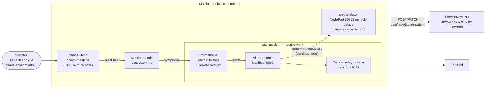

# Chaos Engineering Pipeline

A closed-loop pipeline: a Chaos Mesh fault produces a real Prometheus
alert, the alert becomes a real ServiceNow incident, and recovery closes
the incident automatically — the incident lifecycle an IT operations team
works with (ticket, triage state, MTTR), with nothing simulated except
the business impact.

**Status (2026-07-12):** Chaos Mesh is installed and healthy (Flux
HelmRelease, chart 2.8.3), but **no experiment has ever been run** — the
first real chaos session is the next milestone. The alert → incident path
was verified end-to-end today up to the ServiceNow PDI answering (the
instance is currently hibernating; see constraints).

## Architecture



There is no kube-prometheus-stack, no PrometheusRule CRs, and no
ServiceMonitors: that migration was attempted 2026-05-30 and rolled back
because the chart's pod-network scraping can't work on this cluster. See
[the postmortem](../docs/postmortems/2026-05-30-kube-prom-stack-cutover-rollback.md)
and the ADRs in progress under `../docs/decisions/` (001: design around
the CNI constraint with hostNetwork + same-node NodePort; 002:
helm-controller-only GitOps).

### How alerts flow (verified end-to-end 2026-07-12)

1. Prometheus (star-garden, `hostNetwork`) evaluates plain rule files:
   the host-health groups in `../monitoring/monitoring.yml` (all labelled
   `team: infrastructure`) plus a private overlay — ConfigMaps
   `prometheus-private-scrape` / `prometheus-private-rules` mounted via
   `scrape_config_files` and `rule_files` globs, so private targets and
   rules never enter this repo.
2. Alerts go to Alertmanager on the same host at `localhost:9093`.
3. The route matcher `team = infrastructure` sends the alert to the
   `servicenow` webhook `http://100.92.211.3:30891/webhook` with
   `continue: true`, so it also reaches the Discord receiver (relay
   sidecar at `localhost:9097`). The webhook URL is a NodePort on the
   **same node** as the sn-translator pod — cross-node NodePort doesn't
   work on this cluster.
4. `sn-translator` creates the incident (severity → urgency/impact,
   namespace → category); when Alertmanager sends `resolved`, it PATCHes
   the incident to Resolved.

## Layout

```
chaos/
├── chaos-mesh/            # LIVE — reconciled by the Flux helm-controller
│   ├── namespace.yml      # privileged PSA labels
│   ├── helmrelease.yml    # HelmRepository + HelmRelease (dashboard off, k3s containerd socket)
│   └── kustomization.yml
└── experiments/           # committed, NEVER auto-applied — manual kubectl apply only
    ├── pod-kill.yml       # PodChaos — kill one ecosystem pod
    ├── network-delay.yml  # NetworkChaos — 200–500ms egress latency in ecosystem for 2m
    ├── cpu-stress.yml     # StressChaos — 80% CPU on the control-plane node for 90s
    └── kustomization.yml

../apps/sn-translator/     # FastAPI Alertmanager → ServiceNow bridge (+ manifests/)
../monitoring/monitoring.yml  # the LIVE hand-rolled Prometheus/Alertmanager/Grafana stack
```

GitOps posture: the Chaos Mesh HelmRelease is the **only** Flux-managed
object in the repo — no GitRepository/Kustomization sync exists.
Everything else is applied by hand, and `chaos/experiments/` is excluded
from any automated apply on purpose: injecting a fault is always a
deliberate `kubectl apply`, never a side effect of a reconcile loop.

## sn-translator notes

- **Batch isolation** — one poisoned alert no longer aborts a webhook
  batch; failures return 502 so Alertmanager retries delivery.
- **Dedup** — creates are keyed by alert fingerprint in SQLite at
  `/data/incidents.db` (PVC), so retries don't spawn duplicate incidents.
- **Hibernation detection** — a hibernating PDI answers 200 with HTML;
  `/health` reports it as `servicenow_reachable: false`.
- **Config split** — the real instance hostname is *not* in this repo: it
  arrives via the out-of-band `sn-translator-env` ConfigMap (`envFrom`,
  optional) with `SN_NAMESPACE_CATEGORIES`; credentials come from the
  SealedSecret in `../apps/sn-translator/manifests/` (the committed
  ciphertext is the working one).
- **Image** — built locally, no registry (`imagePullPolicy: IfNotPresent`):

  ```bash
  docker build -t sn-translator:latest apps/sn-translator/
  docker save sn-translator:latest | sudo /usr/local/bin/k3s ctr images import -
  kubectl -n ecosystem rollout restart deploy/sn-translator
  ```

## Runbook

The sn-translator container has **no curl, wget, or sqlite3 CLI** — only
`python3` (3.12). In-pod snippets below use it; from any tailnet host,
plain `curl` against the NodePort works too.

### Pre-flight (every session)

```bash
# 1. Chaos Mesh healthy — HelmRelease Ready, all pods Running:
kubectl -n chaos-mesh get helmrelease,pods

# 2. sn-translator healthy — from a tailnet host:
curl -s http://100.92.211.3:30891/health
# {"status":"ok","servicenow_reachable":true,...}
# → false means the PDI is hibernating: wake it at developer.servicenow.com
#   before injecting anything, or every create will 502-and-retry.

#    ...or the same check from inside the pod:
kubectl -n ecosystem exec deploy/sn-translator -- python3 -c \
  "import urllib.request; print(urllib.request.urlopen('http://localhost:8091/health', timeout=10).read().decode())"

# 3. Prometheus has the alert rules loaded:
curl -s http://100.123.222.55:30090/prometheus/api/v1/rules \
  | python3 -c "import sys,json; print(sorted(g['name'] for g in json.load(sys.stdin)['data']['groups']))"
# expect at least: alerting-path, host-availability, host-cpu, host-disk,
# host-memory (private-overlay groups may also appear)
```

### Running an experiment

Applying an experiment is always a manual, deliberate act:

```bash
kubectl apply -f chaos/experiments/pod-kill.yml

# Watch the fault land and recover:
kubectl -n ecosystem get pods -w

# Watch what Alertmanager sees:
curl -s 'http://100.123.222.55:9093/api/v2/alerts?active=true' \
  | python3 -c "import sys,json; [print(a['labels'].get('alertname'), a['status']['state']) for a in json.load(sys.stdin)]"

# Every experiment carries a duration and auto-expires, but delete it so a
# future apply re-fires instead of no-opping against the old resource:
kubectl delete -f chaos/experiments/pod-kill.yml
```

Honest caveat: the committed rules are host-health level — a pod-kill
recovers in seconds and `cpu-stress` (90s) is shorter than the CPU rule's
sustain window, so neither is guaranteed to page yet. Pairing each
experiment with a rule that fires inside its fault window is part of the
first chaos session's scope.

### Closing the loop

```bash
# What the translator did with the webhook:
kubectl -n ecosystem logs deploy/sn-translator --tail=20

# Open (unresolved) incidents in the local store:
kubectl -n ecosystem exec deploy/sn-translator -- python3 -c "
import sqlite3
for row in sqlite3.connect('/data/incidents.db').execute(
    'SELECT fingerprint, number, alertname, created_at FROM incidents WHERE resolved_at IS NULL'):
    print(*row)"
```

Then confirm the incident in the PDI UI, capture the Grafana window, and
write a short note under `../docs/postmortems/`: did the alert fire when
expected, did the incident carry enough context to triage, did closure
happen without operator intervention?

### Manual incident closure

If an experiment is interrupted and the `resolved` webhook never arrives,
close the incident in the ServiceNow UI, then mark it resolved locally so
the fingerprint doesn't stay open:

```bash
kubectl -n ecosystem exec deploy/sn-translator -- python3 -c "
import sqlite3
conn = sqlite3.connect('/data/incidents.db')
conn.execute('UPDATE incidents SET resolved_at = CURRENT_TIMESTAMP WHERE fingerprint = ?', ('<paste>',))
conn.commit()"
```

## Known constraints

- **Pod network is broken cluster-wide** — kube-router's FORWARD chain
  drops pod-network traffic, so pod-to-pod TCP fails even same-node.
  Everything here designs around it: monitoring runs `hostNetwork` and
  Alertmanager reaches sn-translator via a same-node NodePort. Details in
  the [2026-05-30 postmortem](../docs/postmortems/2026-05-30-kube-prom-stack-cutover-rollback.md).
- **PDI hibernation** — a developer instance hibernates after ~10 idle
  days and answers 200 + HTML instead of the API. `/health` surfaces it;
  failed creates 502 so Alertmanager keeps retrying until it's woken.
- **Chaos Mesh dashboard is disabled** — experiments are managed with
  `kubectl` against `chaos/experiments/`.
