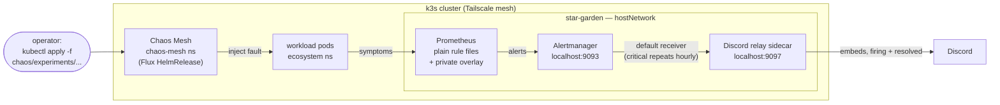

# Chaos Engineering Pipeline

A closed-loop pipeline: a Chaos Mesh fault disrupts a real workload, a
real Prometheus rule fires, Alertmanager delivers a real Discord
notification, and when the experiment ends and the workload recovers,
the alert resolves and Discord gets the all-clear — a full
detect → notify → recover lifecycle, with nothing simulated except the
business impact.

**Status (2026-07-12):** Chaos Mesh is installed and healthy (Flux
HelmRelease, chart 2.8.3), but **no experiment has ever been run** — the
first real chaos session is the next milestone. Alert routing is
Discord-only as of today: the ServiceNow incident leg was retired when
its dev instance expired — see
[ADR-003](../docs/decisions/003-retire-servicenow-pipeline.md) and the
[history section](#history-the-servicenow-chapter) below.

## Architecture



There is no kube-prometheus-stack, no PrometheusRule CRs, and no
ServiceMonitors: that migration was attempted 2026-05-30 and rolled back
because the chart's pod-network scraping can't work on this cluster. See
[the postmortem](../docs/postmortems/2026-05-30-kube-prom-stack-cutover-rollback.md)
and the ADRs under `../docs/decisions/` (001: design around the CNI
constraint with hostNetwork + same-node NodePort; 002:
helm-controller-only GitOps).

### How alerts flow

1. Prometheus (star-garden, `hostNetwork`) evaluates plain rule files:
   the committed groups in `../monitoring/monitoring.yml` (all labelled
   `team: infrastructure`) plus a private overlay — ConfigMaps
   `prometheus-private-scrape` / `prometheus-private-rules` mounted via
   `scrape_config_files` and `rule_files` globs, so private targets and
   rules never enter this repo.
2. Alerts go to Alertmanager on the same host at `localhost:9093`.
3. The default route delivers everything to the `discord` receiver — a
   relay sidecar in the Alertmanager pod (`localhost:9097`) that turns
   webhook payloads into Discord embeds, with `send_resolved: true` so
   recovery posts too. A `severity: critical` sub-route repeats hourly
   instead of the default 4h.
4. When the experiment's duration expires and the workload recovers, the
   rule stops firing and Alertmanager sends the `resolved` notification —
   the loop closes with no operator action.

The `team: infrastructure` labels on the rules are deliberately kept
even though nothing routes on them today: they are the routing taxonomy
a future ticketing receiver would key on (see
[ADR-003](../docs/decisions/003-retire-servicenow-pipeline.md)).

## Layout

```
chaos/
├── chaos-mesh/            # LIVE — reconciled by the Flux helm-controller
│   ├── namespace.yml      # privileged PSA labels
│   ├── helmrelease.yml    # HelmRepository + HelmRelease (dashboard off, k3s containerd socket)
│   └── kustomization.yml
└── experiments/           # committed, NEVER auto-applied — manual kubectl apply only
    ├── pod-kill.yml       # PodChaos — kill one ecosystem pod
    ├── network-delay.yml  # NetworkChaos — 200–500ms egress latency in ecosystem for 2m
    ├── cpu-stress.yml     # StressChaos — 80% CPU on the control-plane node for 90s
    └── kustomization.yml

../monitoring/monitoring.yml  # the LIVE hand-rolled Prometheus/Alertmanager/Grafana stack
```

GitOps posture: the Chaos Mesh HelmRelease is the **only** Flux-managed
object in the repo — no GitRepository/Kustomization sync exists.
Everything else is applied by hand, and `chaos/experiments/` is excluded
from any automated apply on purpose: injecting a fault is always a
deliberate `kubectl apply`, never a side effect of a reconcile loop.

## Runbook

All commands run from a tailnet host with `kubectl` access; the
Prometheus and Alertmanager endpoints are plain HTTP on star-garden's
Tailscale IP.

### Pre-flight (every session)

```bash
# 1. Chaos Mesh healthy — HelmRelease Ready, all pods Running:
kubectl -n chaos-mesh get helmrelease,pods

# 2. Alertmanager up and ready:
curl -s http://100.123.222.55:9093/api/v2/status \
  | python3 -c "import sys,json; d=json.load(sys.stdin); print(d['cluster']['status'], d['versionInfo']['version'])"

# 3. Prometheus has the alert rules loaded:
curl -s http://100.123.222.55:30090/prometheus/api/v1/rules \
  | python3 -c "import sys,json; print(sorted(g['name'] for g in json.load(sys.stdin)['data']['groups']))"
# expect at least: alerting-path, host-availability, host-cpu, host-disk,
# host-memory, slo-ecosystem-availability, tls-certs
# (private-overlay groups may also appear)
```

### Running an experiment

Applying an experiment is always a manual, deliberate act:

```bash
kubectl apply -f chaos/experiments/pod-kill.yml

# Watch the chaos-mesh CRs (experiments live in the chaos-mesh namespace):
kubectl -n chaos-mesh get podchaos,networkchaos,stresschaos

# Watch the fault land and recover:
kubectl -n ecosystem get pods -w

# What Prometheus thinks — pending/firing alerts:
curl -s http://100.123.222.55:30090/prometheus/api/v1/alerts \
  | python3 -c "import sys,json; [print(a['labels'].get('alertname'), a['state']) for a in json.load(sys.stdin)['data']['alerts']]"

# What Alertmanager sees:
curl -s 'http://100.123.222.55:9093/api/v2/alerts?active=true' \
  | python3 -c "import sys,json; [print(a['labels'].get('alertname'), a['status']['state']) for a in json.load(sys.stdin)]"

# Every experiment carries a duration and auto-expires, but delete it so a
# future apply re-fires instead of no-opping against the old resource:
kubectl delete -f chaos/experiments/pod-kill.yml
```

Honest caveat: the committed rules are host-health level — a pod-kill
recovers in seconds and `cpu-stress` (90s) is shorter than the CPU rule's
sustain window, so neither is guaranteed to page yet. Pairing each
experiment with a rule that fires inside its fault window is part of the
first chaos session's scope.

### Closing the loop

```bash
# What the Discord relay did with each webhook delivery:
kubectl -n monitoring logs deploy/alertmanager -c discord-webhook
```

Then confirm the firing and resolved messages in the Discord channel,
capture the Grafana window, and write a short note under
`../docs/postmortems/`: did the alert fire when expected, did the
notification carry enough context to triage, did it resolve without
operator intervention?

## Known constraints

- **Pod network is broken cluster-wide** — kube-router's FORWARD chain
  drops pod-network traffic, so pod-to-pod TCP fails even same-node.
  Everything here designs around it: monitoring runs `hostNetwork`, and
  the whole alert path (Prometheus → Alertmanager → Discord relay) stays
  on localhost within star-garden. Details in the
  [2026-05-30 postmortem](../docs/postmortems/2026-05-30-kube-prom-stack-cutover-rollback.md).
- **Chaos Mesh dashboard is disabled** — experiments are managed with
  `kubectl` against `chaos/experiments/`.

## History: the ServiceNow chapter

Until 2026-07-12 this pipeline closed the loop one step further: a
purpose-built FastAPI translator (`sn-translator`) turned Alertmanager
webhooks into ServiceNow incidents on a free developer instance —
fingerprint-deduplicated create-on-firing / resolve-on-clear, state that
survived restarts, and batch-isolation semantics covered by tests. The
full path (rule → Alertmanager → `team=infrastructure` route →
translator → incident) was verified end-to-end on 2026-07-12. The dev
instance expired that same week, and rather than chase a replacement the
pipeline was retired: the learning goals — webhook receiver design,
incident lifecycle, dedup across restarts — were met and documented, and
day-to-day operations only need Discord. The rationale is in
[ADR-003](../docs/decisions/003-retire-servicenow-pipeline.md); the
translator's code and test suite live in git history, one
`git checkout` away if ticket-lifecycle work becomes relevant again.
